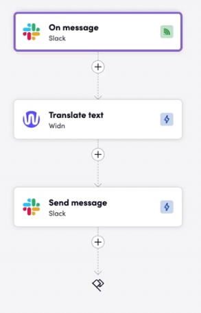
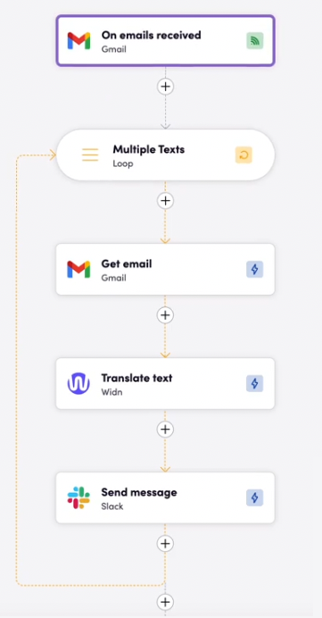

# Widn

**Widn is** translation AI for everyone. Widn’s AI provides accurate translations, preserving meaning, maintaining brand voice, and cultural nuances across +20 language pairs and various domains.

## **Before Setting Up**

- After signing in at [https://www.widn.ai/](https://www.widn.ai/), go to the toolbar on the left and click on **API Key.**
- Generate your API key.

## **Connecting**

1. Navigate to **Apps** and identify the Widn app. You can use the search to find it.
2. Click *Add Connection*.
3. Name your connection for future reference, e.g., "My Widn connection."
4. Fill in the API key from your Widn account.
5. Click *Connect*.

## **Actions**

### **Translation**

- **Translate Text** translates plain text.

Widn offers translation inputs for model selection, extra instructions, and a glossary.

You can now translate files by uploading your file with the source and target languages. XLIFF translation is already available via the Widn API, alongside PDF and these other file types: [Supported File Formats](https://help.unbabel.com/hc/en-us/articles/11241362647447-Supported-file-formats).

## **Examples**

### Slack Bird

The example shows Widn AI being used as a Slack integration.

### Email Bird

**Example**: Whenever a new email comes in, it is sent for translation using [widn.ai](http://widn.ai/). Afterward, it is sent to a Slack channel with the email translated into the desired language. This is another way you can utilize [widn.ai](http://widn.ai/).

## **Feedback**

Do you want to use this app or have feedback on our implementation? Reach out to us using the [established channels](https://www.blackbird.io/) or create an issue.

